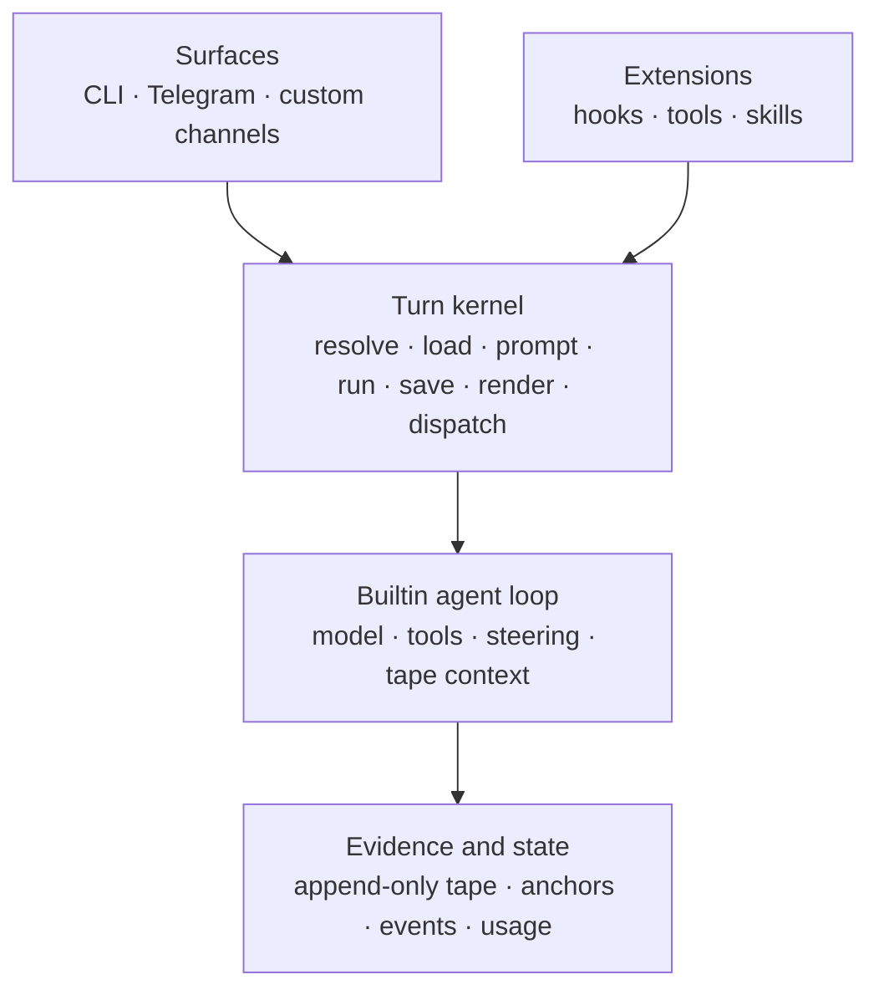

# Studying Bub's Architecture

> A source-based guide to the design practices demonstrated by this repository.
>
> Snapshot reviewed: commit `2dd63a0`. The primary evidence is the code under
> `src/bub/`, its behavior tests under `tests/`, and the English architecture
> documentation under `website/src/content/docs/docs/`.

## 1. The short version

Bub is a useful study in building a small agent runtime without making the
kernel responsible for every integration. Its strongest architectural choices
are:

- one explicit turn pipeline instead of hidden framework control flow;
- a small hook contract, with builtins using the same extension mechanism as
  third-party plugins;
- flexible integration data at the edges, but named and typed decision objects
  at important control boundaries;
- transport-neutral streaming and error vocabulary;
- append-only tape records from which context is rebuilt;
- concurrency owned by a channel scheduler, with admission policy separated
  from task mechanics;
- async resource lifetimes expressed with context managers and `finally`;
- structured, correlated operational facts rather than logs as the only source
  of truth;
- tests that specify ordering, cleanup, cancellation, fallback, and terminal UI
  behavior rather than merely exercising happy-path functions.

The central lesson is not “use Pluggy” or “use a tape.” It is this:

> Keep the invariant-bearing core small, expose variation through explicit
> contracts, and make ordering, ownership, failure, and cleanup semantics
> visible in code.

## 2. A map of the system

The runtime can be understood as four concentric layers:



The important dependency direction is inward:

- channels know how to turn outside events into envelopes;
- the framework knows only the turn stages and routing protocols;
- the builtin agent knows model/tool/tape mechanics;
- storage knows nothing about Telegram, Typer, or a particular model provider.

The major source locations are:

| Concern | Owner |
| --- | --- |
| Turn orchestration | `src/bub/framework.py` |
| Hook declarations and execution | `src/bub/hooks/` |
| Envelope vocabulary | `src/bub/envelope.py` |
| Turn vocabulary | `src/bub/turn.py` |
| Streaming vocabulary | `src/bub/streaming.py` |
| Error vocabulary | `src/bub/errors.py` |
| Channel lifecycle and scheduling | `src/bub/channels/` |
| Agent loop | `src/bub/builtin/agent.py` |
| Model loop | `src/bub/builtin/model_runner.py` |
| Tool API and execution | `src/bub/tools.py`, `builtin/tools.py` |
| Tape vocabulary | `src/bub/tape.py` |
| Tape service | `src/bub/builtin/tape.py` |
| Tape persistence | `src/bub/builtin/store.py` |
| Configuration | `src/bub/configure.py`, `builtin/settings.py` |
| Skill discovery | `src/bub/skills.py` |

This organization follows subsystem ownership. There is no ever-growing
`common.py` full of unrelated contracts.

## 3. The turn pipeline is the architectural spine

### 3.1 The control flow is deliberately boring

`BubFramework.process_inbound` is short enough to read as a transaction script:

```python
session_id = await self.resolve_session(inbound)
state = await self.build_state(inbound, session_id)
prompt = await self.build_prompt(inbound, session_id, state)
model_output = ""
try:
    model_output = await self._run_model(
        inbound, prompt, session_id, state, stream_output
    )
finally:
    await self._hook_runtime.call_many(
        "save_state",
        session_id=session_id,
        state=state,
        message=inbound,
        model_output=model_output,
    )

outbounds = await self._collect_outbounds(
    inbound, session_id, state, model_output
)
for outbound in outbounds:
    await self._hook_runtime.call_many(
        "dispatch_outbound", message=outbound
    )
```

That yields the following lifecycle:

```text
Envelope
   │
   ├─ resolve_session      choose identity
   ├─ load_state          compose per-turn state
   ├─ build_prompt        normalize text/media/commands
   ├─ run_model[_stream]  execute the agent or replacement
   ├─ save_state          close/persist model-stage resources
   ├─ render_outbound     turn output into envelopes
   └─ dispatch_outbound   route each envelope
        ↓
TurnResult
```

This is good orchestration code because:

1. stage order is visible rather than distributed across callbacks;
2. each stage has one vocabulary and one hook name;
3. intermediate values are explicit;
4. fallbacks are located next to the stage they protect;
5. the returned `TurnResult` makes the whole turn inspectable in tests and
   embedding applications.

### 3.2 The pipeline degrades predictably

Several stages have kernel-level defaults:

- no session hook result → `"{channel}:{chat_id}"`;
- no prompt result, or a falsy selected prompt → inbound text;
- no model result → notify `on_error` and echo a safe text fallback;
- no rendered envelopes → construct one from the model output and original
  routing fields.

These defaults let a minimal plugin replace only one concern. They also prevent
the framework from silently returning an incomplete result.

There is an important semantic detail in `build_prompt`: `call_first` stops at
the first value that is not `None`. If that implementation returns `""`, lower
priority prompt hooks do not run; the framework then applies its inbound-text
fallback. “No opinion” is therefore `None`, not an empty string.

### 3.3 Cleanup is explicit, with a precise boundary

`save_state` is in a `finally` around model execution. The builtin uses it to
close a message lifespan with the active exception:

```python
tp, value, traceback = sys.exc_info()
lifespan = field_of(message, "lifespan")
if lifespan is not None:
    await lifespan.__aexit__(tp, value, traceback)
```

This is a strong pattern: resource cleanup is attached to the orchestration
boundary that owns the resource, and failures are passed to the context manager
instead of hidden.

The guarantee is intentionally narrower than “`save_state` always runs.”
It runs once prompt construction has succeeded and the framework enters the
model-stage `try`. A failure in `resolve_session`, `load_state`, or
`build_prompt` occurs before that `try`. Extension authors should therefore
acquire turn-long resources as late as practical, or contribute a broader
lifespan hook if cleanup must cover earlier stages.

## 4. Hook design: three composition semantics, not one

The hook system is more thoughtful than a generic event bus. Different
operations use different algebra.

### 4.1 First-result hooks select an implementation

Examples include `resolve_session`, `build_prompt`, `run_model`,
`provide_tape_store`, and `build_tape_context`. The runtime visits
implementations in last-registered-first order and stops at the first non-`None`
value:

```python
for impl in self._iter_hookimpls(hook_name):
    value = await self._invoke_impl_async(...)
    if value is not None:
        return value
```

This is appropriate for replaceable policies or providers: there should be one
session resolver or one tape store for a given call.

### 4.2 Broadcast hooks contribute and merge

Examples include `load_state`, `system_prompt`, `provide_channels`,
`render_outbound`, and `dispatch_outbound`.

The framework gives each collection an explicit merge policy:

| Hook | Composition rule |
| --- | --- |
| `load_state` | merge low priority first, high priority last; high priority wins key collisions |
| `system_prompt` | skip empty blocks and concatenate from low to high priority |
| `provide_channels` | collect all; first channel seen for a name wins, so high priority overrides duplicates |
| `render_outbound` | flatten every implementation's batch |
| `dispatch_outbound` | notify every dispatcher for every outbound |
| `provide_model_options` | append high-priority choices first; first current model wins |

The lesson is to document the merge operation, not merely say “plugins can
contribute.” Composition without collision rules becomes accidental behavior.

### 4.3 Interception hooks form a chain of responsibility

LLM and tool interception needs a third semantic. `before_llm_call` and
`before_tool_call` fold changes through every implementation:

```python
request, decision = await hooks.before_llm_call(request, state)
```

Each hook sees the request produced by the previous hook. It may:

- return a modified immutable request;
- return `None` to leave it unchanged;
- return a named decision object to short-circuit.

For example:

```python
from dataclasses import replace

from bub import hookimpl
from bub.hooks.interception import LlmCallDecision, LlmCallRequest


class BudgetAndRouting:
    @hookimpl
    def before_llm_call(self, request: LlmCallRequest, state):
        used = state.get("llm_calls", 0)
        if used >= 5:
            return LlmCallDecision.finish("Call budget reached.")
        state["llm_calls"] = used + 1
        return replace(request, model="openai:gpt-4o-mini", max_tokens=512)
```

Tools use `ToolCallDecision.proceed`, `replace`, and `deny` rather than magic
return types or exceptions. This makes policy visible and testable.

### 4.4 Precedence is designed, tested, and diagnosable

Builtins register first; entry-point plugins register afterward. The runtime
reverses Pluggy's implementation list, so later registration means higher
runtime priority. Tests assert the exact order, including the case where the
highest-priority implementation returns `None`.

`bub hooks` exposes a hook-to-plugin report. This matters because extension
precedence that cannot be inspected is difficult to operate.

### 4.5 Hook signatures are tolerant without becoming unstructured

`HookRuntime._kwargs_for_impl` sends only arguments named by an implementation:

```python
return {
    name: kwargs[name]
    for name in impl.argnames
    if name in kwargs
}
```

That lets the contract add optional context without forcing every existing
plugin to accept unused parameters. At the same time, the hookspec still owns
the canonical names and meanings.

### 4.6 Fault isolation is selective

Ordinary turn hooks are not silently isolated: a broken state loader or renderer
fails the turn, where the top-level error path can report it. Two observer-like
families are isolated:

- `on_error` implementations cannot mask the original error or block another
  observer;
- agent-loop before/after hooks log and skip a broken adapter.

That distinction is good. Fault isolation is valuable for observers, but
swallowing failures in state-producing hooks would create a corrupt partial
turn.

## 5. API design

### 5.1 Keep the public root small

The top-level package exports only the common construction API:

```python
__all__ = [
    "BubFramework",
    "Settings",
    "config",
    "ensure_config",
    "home",
    "hookimpl",
    "tool",
]
```

Subsystem contracts are imported from their owners:

```python
from bub.envelope import Envelope
from bub.turn import TurnResult, TurnState
from bub.streaming import AsyncStreamEvents, StreamEvent
from bub.channels.contracts import ChannelRouter, MessageHandler
```

This avoids turning `bub.__init__` into a compatibility burden. The old
`bub.types` module is a small deprecation shim with a warning and explicit
replacement imports, which is a clean migration practice.

### 5.2 Be flexible at integration edges, strong at decisions

`Envelope` is deliberately `Any`. Adapters may submit a mapping, dataclass,
Pydantic object, or attribute-based object. Four helpers centralize the
duck-typing:

```python
field_of(message, "chat_id", "default")
content_of(message)
normalize_envelope(message)
unpack_batch(render_result)
```

This is a pragmatic plugin boundary: the kernel does not impose one transport
schema on every integration.

Control decisions are much stronger:

- `AdmitDecision` has a literal action set;
- `TurnSnapshot` names scheduler state;
- `LlmCallRequest` and `ToolCall` are frozen dataclasses;
- `BubError` carries a stable enum kind;
- `StreamEvent.kind` is a literal event vocabulary;
- `ModelOptions` separates model discovery from selection UI.

The pattern is “permissive payload, typed control plane.”

The trade-off is real: misspelled envelope fields and arbitrary `TurnState` keys
cannot be caught statically. Bub reduces that risk with accessor helpers and an
`_runtime_*` naming convention. A larger system could gradually introduce
`TypedDict` views without forcing every channel into one concrete message class.

### 5.3 Use structural protocols for injected collaborators

`TapeStore`, `AsyncTapeStore`, `ChannelRouter`, `SteeringInbox`, and
`ToolCallReporter` are protocols. Implementers do not need to inherit from a
framework base class.

By contrast, `Channel` is an abstract base class because it owns lifecycle
defaults such as `send`, `stream_events`, and `admit_message`, and has semantic
marker subclasses `Interface` and `Lifecycle`.

This is a good division:

- use a `Protocol` when only a call shape matters;
- use an ABC when shared behavior and classification are part of the contract.

### 5.4 Return useful values from orchestration

`process_inbound` returns:

```python
@dataclass(frozen=True)
class TurnResult:
    session_id: str
    prompt: str | list[dict[str, Any]]
    model_output: str
    outbounds: list[Envelope]
    state: TurnState
```

The CLI can render outbounds, tests can inspect the resolved prompt, and an
embedding application can examine final state without scraping logs.

The dataclasses are frozen to discourage rebinding control records. Note that
their nested lists and dictionaries remain mutable; this is shallow, not deep,
immutability.

### 5.5 Adapt sync and async at one boundary

Two examples keep compatibility logic out of business code:

- `HookRuntime` adapts `run_model` to a one-event stream and accumulates a
  streaming implementation into text when needed;
- `AsyncTapeStoreAdapter` uses `asyncio.to_thread` to expose a synchronous tape
  store without blocking the event loop.

Callers can stay async while providers migrate independently.

## 6. Concurrency and lifecycle management

### 6.1 The channel manager owns tasks

`ChannelManager` has one inbound `asyncio.Queue` and creates a task for each
admitted message:

```python
task = asyncio.create_task(self._run_message(message))
task.add_done_callback(
    functools.partial(self._on_task_done, message.session_id)
)
controller.active_tasks.add(task)
```

Every task is registered in a per-session `SessionTurnController`. Ownership is
therefore explicit:

- the controller knows active tasks and FIFO pending messages;
- completion removes the task and schedules the next pending item;
- `quit(session_id)` cancels only that session's work;
- shutdown cancels all owned tasks before stopping channels.

This is better than “fire and forget”: every task has a collection, a done
callback, and a cancellation path.

### 6.2 Scheduling mechanics and admission policy are separate

Before a task is created, the manager asks `admit_message` with a snapshot:

```python
TurnSnapshot(
    session_id=...,
    is_running=...,
    running_count=...,
    pending_count=...,
    steering_count=...,
)
```

The decision vocabulary is:

| Action | Meaning |
| --- | --- |
| `process` | start now |
| `drop` | discard explicitly |
| `follow_up` | enqueue behind active work |
| `steer` | inject into the running agent if possible; otherwise enqueue |

The default `None` decision preserves concurrent processing, even within the
same session. Serialization is a policy, not an accidental global lock. The CLI
channel chooses `steer` while it is generating; another channel can choose a
different policy.

Admission happens before the message's lifespan is entered. A queued Telegram
message therefore does not start a typing indicator or hold other per-message
resources while waiting. A dedicated test asserts this boundary.

If session resolution fails, the message is dropped after notifying error
observers. If an admission hook itself fails, the manager reports it and fails
open by processing the message. That is a deliberate availability choice:
broken optional policy does not stop the channel.

### 6.3 Debouncing is per session and preserves operator commands

Channels opt into `needs_debounce`. `BufferedMessageHandler` then:

- drops inactive noise outside an active window;
- batches message text and media;
- waits a short debounce after an active message;
- caps the wait for follow-ups;
- sends comma commands immediately.

The batch uses the newest message as the metadata template while joining all
content and media:

```python
template = batch[-1]
content = "\n".join(message.content for message in batch)
media = [item for message in batch for item in message.media]
return replace(template, content=content, media=media)
```

This preserves the most recent routing metadata without losing earlier
attachments.

### 6.4 Parallel tool execution keeps deterministic result order

One model response may request multiple tools. `ToolExecutor` runs them
concurrently:

```python
gathered = await asyncio.gather(
    *(self._handle_tool_response_async(tool, args, context)
      for tool, args in invocations),
    return_exceptions=True,
)
```

`gather` returns results in invocation order, so tool results still line up with
the original tool-call IDs even if completion order differs. Normal tool
failures become `BubError` values and serialized result payloads, allowing
sibling calls to finish. Cancellation and other `BaseException` values still
propagate.

That is an effective concurrency rule: parallelize independent work, preserve
protocol ordering, and do not turn a domain failure into cancellation of
unrelated calls.

### 6.5 The agent loop is sequential where causality matters

Model/tool steps are intentionally sequential. A step:

1. builds context;
2. performs one model completion;
3. executes any requested tools;
4. records the result;
5. continues only when tool work or steering requires another completion.

The loop has a configured `max_steps` guard. Model calls have
`asyncio.timeout(settings.model_timeout_seconds)`. This prevents an extension
or provider from making the turn unbounded.

Steering messages are drained as a batch, and their independent prompt
normalizations use `asyncio.gather`. This is a smaller example of parallelizing
only work with no ordering dependency.

### 6.6 Stream lifetime owns transaction lifetime

`Agent.run_stream` opens a forked tape with `AsyncExitStack`. It cannot close the
fork when `run_stream` returns because the returned iterator has not yet been
consumed. Bub wraps the stream:

```python
async def generator():
    try:
        async for event in events:
            yield event
    finally:
        await stack.aclose()
```

The fork merges and resources close when iteration completes, raises, is
cancelled, or the consumer closes the generator. This is an excellent example
of matching a resource lifetime to lazy consumption rather than function
return.

Consumers still have a responsibility to exhaust or explicitly close streams.
Creating a stream and abandoning it without iteration postpones cleanup.

### 6.7 Subprocesses are supervised

`ShellManager` avoids a common async subprocess deadlock by draining stdout and
stderr in separate tasks. It records shells by ID and session, supports
background polling, terminates gently, escalates to kill after three seconds,
and awaits drain tasks before release.

The `bash` tool also handles timeout and cancellation explicitly:

```python
try:
    async with asyncio.timeout(timeout_seconds):
        shell = await shell_manager.wait_closed(shell.shell_id)
except asyncio.CancelledError:
    await shell_manager.terminate(shell.shell_id)
    raise
except TimeoutError:
    await shell_manager.terminate(shell.shell_id)
```

Cancellation cleanup followed by re-raising is the correct pattern: release the
owned resource without converting cancellation into success.

## 7. Error architecture

### 7.1 A stable domain error crosses boundaries

`BubError` is small and transport-friendly:

```python
class ErrorKind(StrEnum):
    INVALID_INPUT = "invalid_input"
    CONFIG = "config"
    PROVIDER = "provider"
    TOOL = "tool"
    TEMPORARY = "temporary"
    NOT_FOUND = "not_found"
    UNKNOWN = "unknown"


@dataclass(frozen=True)
class BubError(Exception):
    kind: ErrorKind
    message: str
    details: dict[str, Any] | None = None
```

`as_dict()` produces a payload suitable for a stream event, tool result, tape
entry, or channel. Code can decide on `kind` without parsing prose.

### 7.2 Errors are normalized at the boundary that understands them

The tool executor distinguishes:

- Pydantic `ValidationError` → `INVALID_INPUT` with structured validation
  details;
- an existing `BubError` → preserve it;
- another `Exception` from the handler → `TOOL` with the original
  representation in details.

The model runner validates native function-call JSON with a
`TypeAdapter[dict[str, Any]]` and raises `INVALID_INPUT` for malformed calls.
Tape queries similarly use `NOT_FOUND` and `INVALID_INPUT` rather than leaking
`ValueError` from date parsing or anchor lookup.

The general rule is: low-level libraries may raise their native errors, but the
first layer with domain knowledge converts them into the stable public error.

### 7.3 The top-level turn reports and re-raises

Unhandled turn errors follow three steps:

1. log the exception with a traceback;
2. notify every `on_error(stage="turn", ...)` observer;
3. re-raise the original exception.

The builtin observer renders an error envelope, so interactive users can see a
failure even when they do not have logs. Re-raising still lets a gateway,
supervisor, test, or embedding application own retry and exit policy.

Observer exceptions are caught separately:

```python
try:
    value = impl.function(**call_kwargs)
    if inspect.isawaitable(value):
        await value
except Exception:
    logger.opt(exception=True).warning(
        "hook.on_error_failed stage={} adapter={}", ...
    )
```

This prevents secondary telemetry failures from replacing the primary error.

### 7.4 Interception has exactly-once terminal observation

Before/after LLM and tool hooks receive the original terminal exception object.
The model runner protects `after_llm_call` with an `after_fired` flag, so it runs
once on success or ordinary `Exception` failure.

Cancellation and consumer close are `BaseException` paths and intentionally do
not fire “completed call” observers. This distinction avoids recording a
cancelled stream as a completed provider failure.

### 7.5 Provider fallback retains failure information

`completion_response` tries configured model candidates in order. It logs each
failed candidate before trying the next and, if all candidates fail, raises the
first error:

```python
if completion_error is None:
    completion_error = exc
if index == len(clients) - 1:
    raise completion_error from None
```

Raising the first error preserves the failure of the requested model rather
than replacing it with a possibly secondary fallback failure. The warning logs
retain the intermediate candidate evidence.

### 7.6 Context overflow has one bounded recovery

The agent recognizes provider messages that look like context-window overflow.
It writes an `auto_handoff/context_overflow` anchor, records an
`auto_handoff` loop event, and retries once with context rebuilt after the new
anchor.

The retry count is a named constant (`MAX_AUTO_HANDOFF_RETRIES = 1`), so recovery
cannot become an infinite loop. If retry still fails, the original error path
continues normally.

### 7.7 Plugin loading isolates optional failures

Entry-point import and initialization errors are caught per plugin. Bub records
a `PluginStatus` and continues loading the rest. This is appropriate at the
optional-extension boundary. Runtime hook failures, by contrast, normally fail
their turn.

The two-phase loader first imports entry points and then initializes pending
plugins. Configuration is loaded in `BubFramework.__init__` before any callable
plugin is constructed, so plugin constructors can safely read validated runtime
settings.

## 8. Logging and observability

### 8.1 Logs use stable event names

Loguru calls are phrased as machine-searchable events:

```text
loop.step step={} tape={} model={}
tool.call.start name={}
tool.call.success name={} elapsed_time={}
channel.manager admission follow_up session_id={}
session.run.outbound session_id={} content={}
```

The message begins with a stable namespace, then adds named fields. This works
in a terminal today and remains parseable when routed to structured telemetry.

Durations use `time.monotonic()`, which is immune to wall-clock adjustments.
Dates written as evidence use timezone-aware UTC ISO timestamps.

### 8.2 Correlation is part of the data model

Each model call gets a `run_id`. The same value appears in:

- LLM interception request/result objects;
- tool contexts and tool interception records;
- tape entry metadata;
- the terminal `run` event.

This is stronger than adding a correlation ID only to log context: persisted
facts and live observers can be joined later.

### 8.3 The tape is the primary audit surface

Logs describe runtime activity, but the tape records model-visible facts:

- system and user messages;
- assistant responses;
- tool calls and results;
- errors;
- anchors and handoffs;
- loop and command events;
- model and token usage.

That separation is healthy:

- logs answer “what was the process doing?”;
- tape answers “what evidence and context did this session produce?”;
- optional tracing answers “where was time spent across components?”

### 8.4 Optional instrumentation fails open

CLI startup always configures stderr logging. It then tries to add Logfire; if
the optional package or its configuration fails, Bub emits a debug message and
continues. The optional `logfire` dependency group and contrib OpenTelemetry
tape store keep observability from becoming a core runtime dependency.

### 8.5 Context-local reporting decouples tools from the CLI

Tool logging checks a `ContextVar` for a `ToolCallReporter`. The CLI installs a
renderer-specific reporter only around its stream:

```python
with tool_call_reporter(_CliToolCallReporter(self._renderer)):
    async for event in stream:
        ...
```

Other channels continue to receive ordinary logs, and concurrent async tasks
do not overwrite a process-global reporter. This is a good use of
`contextvars` for request-local behavior.

The logger deliberately omits the opaque `ToolContext` and truncates rendered
arguments. It can still log user-supplied argument values, so production
operators should treat logs as potentially sensitive and configure retention
accordingly.

## 9. Tape and persistence architecture

### 9.1 Context is derived, not carried forever

`TapeEntry` is a frozen append-only fact with an ID, kind, payload, metadata,
and UTC date. `TapeContext` is a separate immutable query/selection policy.
Before a model call, the runtime reads tape entries and builds a fresh message
view.

This avoids a common agent-runtime failure mode: an opaque, ever-mutating
conversation list that is both storage and context. Bub separates:

- source facts (`TapeEntry`);
- storage (`TapeStore`);
- selection (`TapeContext`);
- model representation (`build_messages`).

### 9.2 Query builders are immutable

`TapeQuery` methods use `dataclasses.replace`:

```python
query = (
    tape.query()
    .query("timeout")
    .kinds("error", "event")
    .between_dates("2026-01-01", "2026-01-31")
    .limit(20)
)
```

Each method returns a new value, so reusable base queries are not modified by a
later caller.

### 9.3 Session names are workspace-scoped

The physical tape name hashes both the resolved workspace and the session ID:

```python
workspace_hash = md5(str(workspace.resolve()).encode()).hexdigest()[:16]
session_hash = md5(session_id.encode()).hexdigest()[:16]
tape_name = f"{workspace_hash}__{session_hash}"
```

The same Telegram chat or CLI session in two repositories cannot accidentally
share context. `usedforsecurity=False` also documents that MD5 is used as a
stable compact identifier, not as a security primitive.

### 9.4 Anchors are reconstruction markers

Every tape gets a bootstrap `session/start` anchor. A handoff appends both an
anchor and an event. The default context starts after the latest anchor, while
the original history remains intact.

This gives compaction-like behavior without rewriting evidence. A summary or
handoff state is a derivative checkpoint, not a replacement for original
facts.

### 9.5 Forks provide turn-local isolation

Each regular run writes into an in-memory `ForkTapeStore` layered over the
parent:

- reads see parent facts plus fork facts;
- reset can be staged inside the fork;
- normal sessions merge on stream cleanup;
- `temp/` sessions discard their fork;
- parent storage assigns final monotonic IDs during merge.

This gives every turn an isolated write buffer and makes the persistence
boundary explicit. Regular turns, including failed ones, merge on cleanup so
their evidence is retained; disposable `temp/` subagent runs are discarded.

Multimodal prompt entries are redacted in the fork so large data URLs are not
written to persistent tape; text parts remain. This is a practical
data-minimization decision.

The default file store is not a full database transaction. A multi-entry
`record_chat` is a sequence of appends, and `TapeFile` uses an in-process
`threading.Lock`, not a cross-process file lock. The JSONL backend is suitable
for the default single-process runtime; deployments needing atomic multiwriter
semantics should replace `provide_tape_store`.

### 9.6 JSONL storage is simple but carefully implemented

`TapeFile`:

- serializes one entry per line;
- locks reads, resets, and appends;
- incrementally reads from a cached byte offset;
- resets its cache if the file was truncated or replaced;
- ignores malformed lines rather than losing later valid entries;
- synchronizes the cache before allocating the next ID.

The test `test_file_tape_store_assigns_monotonic_ids_when_merging_forked_entries`
captures the subtle invariant: fork-local IDs do not leak into the parent's
sequence.

### 9.7 Tool-call reconstruction preserves protocol identity

The default context mapper remembers the most recent tool calls and associates
results by position. It restores `tool_call_id` and function name on each
`role="tool"` message. Without this, a stored conversation might be human
readable but invalid to the next model API call.

This is a valuable persistence lesson: store enough protocol identity to
faithfully reconstruct the next request, not merely enough text for a log
viewer.

## 10. Channels as adapters, routers, and lifecycles

### 10.1 The channel contract is intentionally narrow

A channel must start and stop. It may additionally:

- send an outbound message;
- wrap stream events for incremental display;
- make an admission decision;
- request debouncing.

The framework communicates through the `ChannelRouter` protocol rather than a
concrete manager. This keeps outbound routing and streaming optional when
`process_inbound` is used directly.

### 10.2 Runtime roles are explicit

`Interface` marks user-facing surfaces. `Lifecycle` marks background services.
Channel selection rules can therefore say:

- interfaces require explicit inclusion;
- lifecycles may accompany enabled interfaces;
- ordinary channels follow include/exclude configuration.

A marker type is preferable here to inferring semantics from a channel name.

### 10.3 Routing metadata stays on the envelope

`output_channel` may differ from the inbound `channel`. `ChannelManager` uses
the former when present and preserves session, chat, content, context, and kind
when constructing a `ChannelMessage`.

This supports patterns such as receiving from one surface but rendering on
another without putting transport conditionals in the framework.

### 10.4 Media is lazy

`MediaItem` can hold a URL or an async `data_fetcher`. Telegram parsing records
metadata immediately but downloads bytes only if prompt construction needs
them. Downloads have an explicit 2 MiB limit, and images become standard
`image_url` content parts.

Lazy I/O keeps admission and batching cheap, especially for messages that will
be dropped or queued.

### 10.5 Adapter policy remains at the edge

Telegram owns:

- user/chat allowlists;
- group mention/reply filtering;
- polling and proxy setup;
- typing indicators;
- Telegram-specific parsing and downloads.

The framework sees only `ChannelMessage`. The CLI similarly owns prompt-toolkit
history, stream repainting, reasoning display, and keyboard mode. A PTY test
verifies that concurrent streaming does not corrupt the active prompt,
including wide Unicode text.

This is the adapter pattern done well: edge quirks stay at the edge, while
shared scheduling and turn behavior remain transport-neutral.

## 11. Tools, skills, and authority surfaces

### 11.1 Keep three different callers separate

| Surface | Caller | Contract |
| --- | --- | --- |
| Channel | outside world | async lifecycle and envelopes |
| Skill | human or agent operator | discoverable Markdown procedure |
| Tool | model | typed callable and JSON schema |

This separation clarifies authority. Adding instructions does not grant a new
callable capability; adding a tool does not create an inbound network surface.

### 11.2 Tool schemas come from Python types

The `@tool` decorator:

- derives a name and description;
- builds JSON Schema with Pydantic;
- validates arguments before invocation;
- supports sync and async handlers;
- optionally injects an explicit `ToolContext`;
- adds timing/reporting;
- registers the resulting immutable `Tool`.

Example:

```python
from pathlib import Path

from bub import tool
from bub.tools import ToolContext


@tool(name="project.word_count", context=True)
def word_count(path: str, *, context: ToolContext) -> int:
    workspace = context.state["_runtime_workspace"]
    text = (Path(workspace) / path).read_text()
    return len(text.split())
```

`context=True` must match an actual `context` parameter. It is omitted from the
model-facing schema and supplied only by the runtime. This prevents the model
from fabricating internal context objects.

Dotted runtime names are converted to model-safe underscore names, then mapped
back for execution. Unknown allowlist names fail early rather than silently
expanding permissions.

The registry is populated by import-time decorator side effects. That makes
tool authoring simple, but plugin packages must import their tool module. It
also means duplicate tool names are last-write-wins; distributions should
manage names deliberately.

### 11.3 Tool policy is applied before execution

`ToolExecutor` creates a `ToolCall` with a copied argument dictionary and lets
interceptors modify, replace, or deny it. The corresponding `after_tool_call`
runs for success, failure, denial, and replacement, with duration and the
effective arguments.

Policy is therefore centralized around execution rather than scattered through
individual tools.

### 11.4 Skills use validated discovery and progressive disclosure

Skills are discovered in this precedence:

1. project `.agents/skills/`;
2. user `~/.agents/skills/`;
3. packaged `skills/` namespace roots.

First occurrence by case-folded name wins. Frontmatter validates name,
directory agreement, description length, kebab-case, and flat metadata.
Malformed or unreadable skills are skipped.

The ordinary system prompt lists only names and descriptions. A `$skill-name`
hint expands the matching body, and the `skill` tool can load one explicitly.
This avoids injecting every long procedure into every model call.

Skill bodies support safe substitution for `SKILL_DIR` and the active Python
executable, plus typed configuration rendering. `string.Template.safe_substitute`
leaves unknown placeholders intact rather than failing an entire turn.

### 11.5 Subagents narrow capabilities

The builtin subagent tool accepts `allowed_tools` and `allowed_skills`. Tool
names are normalized and validated, and `subagent` itself is excluded to avoid
unbounded recursive spawning. Temporary sessions use a `temp/` tape fork that
does not merge back.

This demonstrates capability narrowing: a child gets a copied state plus an
explicit subset, not ambient access chosen implicitly.

The built-in filesystem and shell tools are capabilities, not a security
sandbox. For example, absolute filesystem paths are accepted. A deployment
requiring filesystem isolation must enforce it at the container, OS, or tool
policy layer.

## 12. Configuration architecture

### 12.1 Configuration is extensible but centrally validated

Plugins register Pydantic settings classes:

```python
@config(name="telegram")
class TelegramSettings(Settings):
    model_config = SettingsConfigDict(env_prefix="BUB_TELEGRAM_")
    token: str = ""
    allow_users: str | None = None
```

`configure.py` maintains section-to-settings-class registration. `ensure_config`
creates one cached instance per class and section. Root and named YAML sections
can therefore coexist without a monolithic settings object knowing every
plugin.

### 12.2 Source precedence is explicit

The base source order is environment, dotenv, initialization/YAML data, then
file secrets. `AgentSettings` adds a provider-specific environment source for
keys such as `BUB_OPENAI_API_KEY`.

This makes deployment overrides predictable while still allowing a checked
local YAML configuration.

### 12.3 Validation can ignore ambient environment

Before saving onboarding results, `validate` creates a cached subclass whose
settings sources include only initialization data. This is subtle and good:
an environment variable should not make an invalid YAML value appear valid
during persistence validation.

### 12.4 Plugins see configuration before construction

`BubFramework.__init__` loads the config file. `load_hooks` then loads entry
points and calls callable plugins with the framework. Tests assert that a plugin
constructor can read the configured model.

Initialization order is part of the API; testing it prevents difficult startup
races.

### 12.5 Session state does not mutate process defaults

The `model` command writes a `model_switch` event to the session tape. The next
turn recovers the latest event into `state["model"]` and passes it as a per-call
override. `Agent.settings.model` is never mutated.

That prevents one concurrent session from changing another session's model, and
the tape makes the choice survive a restart.

### 12.6 Plugin dependencies have their own project

`bub install` maintains a separate uv project under `~/.bub/bub-project` (or
`BUB_PROJECT`). It can preserve an editable/source installation of Bub while
adding plugins to the active environment.

This separates application extension management from the source repository's
development dependencies.

## 13. Provider and authentication boundaries

### 13.1 Normalize providers behind one model runner

`ModelRunner` asks `AgentSettings` for ordered `ModelCandidate` values and
creates an `AnyLLM` client for each. The agent loop consumes a canonical
`ChatCompletion` or stream regardless of provider.

The Codex provider adapter translates OpenAI Responses input/output into this
canonical completion vocabulary. Its streaming mapper accumulates fragmented
tool names and JSON arguments, remembers item IDs, avoids duplicate completed
arguments, and emits a standard terminal chunk with usage.

This is an anti-corruption layer: provider-specific formats do not leak into
the tape, tool executor, or channel renderer.

### 13.2 Capability detection drives request shape

The runner asks whether a client supports streaming. It requests
`stream_options.include_usage` only for OpenAI-compatible streaming providers,
because other APIs may reject that field.

This is more robust than sending a lowest-common-denominator payload or
sprinkling provider-name checks through the agent loop.

### 13.3 OAuth state and token lifetime are encapsulated

The Codex OAuth helper includes:

- PKCE verifier generation;
- a random state value and mismatch check when state is returned;
- loopback callback validation and timeout;
- a manual fallback flow;
- strict token payload parsing;
- best-effort `0600` permissions on `auth.json`;
- refresh-before-expiry with a process lock to prevent refresh stampedes;
- fallback to the still-valid old token if refresh fails.

Network/auth details remain outside the generic model runner. The manual flow
allows a bare authorization code with no returned state; PKCE still protects
the code exchange, but callers requiring mandatory state validation should use
the full callback URL/loopback flow.

## 14. Coding style worth copying

### 14.1 Small vocabulary modules

Files such as `errors.py`, `envelope.py`, `streaming.py`, `turn.py`, and
`model_selection.py` are short because each owns one concept. They are not
“miscellaneous types”; their module name explains who owns the contract.

### 14.2 Named dataclasses replace tuple conventions

`TurnResult`, `ModelCandidate`, `TapeInfo`, `AdmitDecision`,
`LlmCallResult`, and `ToolExecution` make call sites self-documenting. Frozen
control records reduce accidental mutation.

### 14.3 Comments explain reasons

Useful comments explain non-obvious constraints:

- why the tape fork must remain open until the last stream chunk;
- why streaming usage options are provider-gated;
- why cancellation bypasses after hooks;
- why state model overrides must not mutate the default;
- why the cache must be synchronized before allocating tape IDs.

They do not restate simple syntax.

### 14.4 Narrow helpers keep orchestration readable

Examples include `content_of`, `workspace_from_state`,
`tool_invocation_from_native`, `_stream_usage_options`,
`_resolve_message_session`, and `_build_tool_result_message`. Each removes a
branching detail from the main control flow.

### 14.5 Standard library primitives are used directly

The project gets significant mileage from:

- `AsyncExitStack` and async context managers for lifetime composition;
- `Protocol` for structural boundaries;
- `dataclasses.replace` for immutable request/query transformations;
- `ContextVar` for task-local reporters;
- `asyncio.Queue`, `Event`, `Task`, `gather`, `timeout`, and
  `to_thread` for explicit concurrency;
- `shlex` for internal command parsing;
- `pathlib` for path semantics.

This keeps custom abstractions focused on Bub's domain rather than wrapping
every language feature.

### 14.6 Modern typing is used where it pays

The code uses Python 3.12+ type aliases, generic query types, `Literal`,
`TypeIs`, overloads, protocols, and precise unions. Ruff and mypy are configured
centrally. Runtime validation is added at untrusted boundaries with Pydantic
rather than assuming type hints validate model-generated JSON.

### 14.7 Local imports make dependency boundaries practical

Provider, channel, CLI, and builtin-tool imports are often local to the method
that needs them. This reduces import cycles and prevents optional or
side-effectful modules from loading before configuration and plugin setup.

Local imports can hide dependencies if overused; here they mostly appear at
known composition roots such as `BuiltinImpl` and CLI commands.

## 15. Testing and delivery practices

### 15.1 Tests describe behavior

Names such as:

- `test_call_first_respects_priority_and_returns_first_non_none`;
- `test_channel_manager_admission_does_not_enter_message_lifespan`;
- `test_agent_run_model_override_does_not_mutate_default`;
- `test_file_tape_store_assigns_monotonic_ids_when_merging_forked_entries`;
- `test_streaming_openai_usage_is_requested_and_recorded_in_tape`

state the invariant being protected.

### 15.2 Async tests inspect lifecycle, not just values

The suite checks:

- context manager enter/exit counts;
- tape fork merge timing before and after stream consumption;
- task cancellation by session;
- pending FIFO order;
- steering drained exactly once;
- observer failure isolation;
- exactly-once after hooks;
- model and tool rewrite propagation;
- subprocess termination and background output.

These tests guard the seams where concurrency regressions usually occur.

### 15.3 Fakes are narrow

Tests generally construct a small fake framework, tape, router, provider, or
channel with only the methods the unit needs. `monkeypatch` and temporary paths
isolate filesystem, environment, time-zone, entry-point, and provider behavior.
No network credential is required for the main suite.

### 15.4 Terminal behavior gets an integration test

The CLI stream/prompt interaction is exercised through a pseudo-terminal, not
only by mocking print calls. This catches cursor and repaint bugs that unit
tests cannot represent.

### 15.5 CI checks multiple dimensions

The main workflow runs:

- formatting/lint hooks;
- pytest and mypy on Python 3.12, 3.13, and 3.14;
- a full Astro documentation build.

Release publishing uses PyPI trusted publishing rather than a long-lived API
token. The package version comes from VCS metadata, and the wheel explicitly
includes bundled skills.

### 15.6 Deployment has proper process handoff

The container uses `tini` as PID 1, and `entrypoint.sh` ends with `exec` for
either a workspace startup script or `bub gateway`. Signals therefore reach the
actual runtime, which matters because shutdown owns task cancellation and
channel cleanup.

## 16. A complete extension example

The following plugin combines the patterns above: typed policy, chained request
rewriting, fault-isolated observation, and state composition.

```python
from dataclasses import replace

from bub import hookimpl
from bub.hooks.interception import (
    LlmCallDecision,
    LlmCallRequest,
    LlmCallResult,
    ToolCall,
    ToolCallDecision,
)


class ProductionPolicy:
    def __init__(self, framework):
        # Callable entry-point classes receive the live BubFramework.
        self.framework = framework

    @hookimpl
    def before_llm_call(self, request: LlmCallRequest, state):
        calls = state.get("policy.llm_calls", 0)
        if calls >= 8:
            return LlmCallDecision.finish(
                "This turn reached its model-call budget."
            )
        state["policy.llm_calls"] = calls + 1
        return replace(request, max_tokens=min(request.max_tokens or 1024, 1024))

    @hookimpl
    def before_tool_call(self, call: ToolCall, state):
        if call.tool == "bash" and not state.get("policy.shell_allowed"):
            return ToolCallDecision.deny("Shell access is disabled.")
        return ToolCallDecision.proceed()

    @hookimpl
    async def after_llm_call(
        self,
        request: LlmCallRequest,
        result: LlmCallResult,
        state,
    ):
        # An observer failure would be logged and skipped by AgentHooks.
        state["policy.last_llm_ms"] = result.duration_ms

    @hookimpl
    def load_state(self, message, session_id):
        return {
            "policy.llm_calls": 0,
            "policy.shell_allowed": False,
        }
```

Package it as an entry point:

```toml
[project.entry-points."bub"]
production-policy = "my_package.plugin:ProductionPolicy"
```

Why this composes cleanly:

- it does not subclass the framework;
- it replaces no turn stage;
- its request rewrite is visible to later interceptors;
- denial is data, not an exception;
- its state keys are namespaced;
- the builtin still provides model execution, tape, channels, and rendering.

## 17. Practices to transfer to other projects

Use this checklist when applying the architecture elsewhere:

### Kernel and extension design

- Can the main lifecycle be read top to bottom in one function?
- Does every extension point say whether it selects, merges, broadcasts, or
  chains?
- Are precedence and collision rules tested?
- Do builtins obey the same extension contract as third-party code?
- Can operators inspect which implementations loaded?

### Async design

- Does every created task have an owner, completion callback, and shutdown path?
- Is admission/backpressure policy separate from scheduling mechanics?
- Are independent calls parallel but protocol results deterministically ordered?
- Does cancellation clean up and then re-raise?
- Do lazy streams keep their resources alive for exactly the consumption
  lifetime?
- Are blocking adapters moved off the event loop?

### Failure design

- Is there one stable domain error with machine-readable categories?
- Are native errors normalized only where domain meaning is known?
- Do observer failures preserve the primary error?
- Are retries bounded and recorded?
- Is the difference between failure, cancellation, denial, and replacement
  explicit?

### State and observability

- Is durable evidence append-only?
- Is model context a derived view rather than the storage object itself?
- Can state be checkpointed without deleting original facts?
- Do logs, traces, and durable records have distinct jobs?
- Is there a correlation ID shared across model calls, tools, and persistence?

### API and maintenance

- Are flexible integration payloads wrapped by accessor helpers?
- Are important decisions named dataclasses rather than strings and tuples?
- Do protocols live beside the subsystem that defines their semantics?
- Is the package root intentionally small?
- Are compatibility shims deprecated with a clear migration path?
- Do tests target lifecycle and ordering boundaries?

## 18. Final assessment

Bub's architecture is strongest where many extensible async systems are weakest:
ordering, ownership, and evidence.

The project does not pretend that every boundary can be statically rigid.
Envelopes and per-turn state stay flexible so plugins and transports remain
cheap to add. It compensates by making the control plane precise: hook
semantics, decision dataclasses, stream events, domain errors, task ownership,
context managers, and append-only records.

The most reusable idea is the combination:

1. an explicit lifecycle kernel;
2. multiple well-defined composition semantics;
3. task and resource ownership at async boundaries;
4. durable facts separated from derived context;
5. strong tests at the seams.

Any one of those patterns is useful. Together, they produce a runtime that can
remain small while still supporting channels, providers, tools, skills,
plugins, persistence, steering, and observability without collapsing those
concerns into one framework object.
