# RyuJIT Study Notes

This document is a code-grounded study guide for RyuJIT, the CoreCLR JIT compiler
implemented mainly under `src/coreclr/jit`. It is a draft intended for learning the
architecture, major phases, APIs, coding style, error model, and optimization design.

Primary source files and docs used:

- `docs/design/coreclr/jit/ryujit-overview.md`
- `docs/design/coreclr/jit/ryujit-tutorial.md`
- `docs/coding-guidelines/clr-jit-coding-conventions.md`
- `src/coreclr/inc/corjit.h`
- `src/coreclr/inc/corinfo.h`
- `src/coreclr/jit/ee_il_dll.cpp`
- `src/coreclr/jit/compiler.cpp`
- `src/coreclr/jit/compiler.h`
- `src/coreclr/jit/compphases.h`
- `src/coreclr/jit/importer.cpp`
- `src/coreclr/jit/lower.cpp`
- `src/coreclr/jit/lsra.cpp`
- `src/coreclr/jit/codegencommon.cpp`
- `src/coreclr/jit/error.h`
- `src/coreclr/jit/error.cpp`
- `src/coreclr/vm/jitinterface.cpp`

## 1. What RyuJIT Is

RyuJIT is the .NET runtime's just-in-time compiler for CoreCLR. The runtime, also
called the EE, VM, or CLR, asks RyuJIT to turn a method's IL into native code.
RyuJIT also participates in ahead-of-time scenarios where the same JIT/EE interface is
used to compile code for ReadyToRun-like flows.

The major design constraints are visible in the docs and source:

- Compatibility with older .NET JIT behavior.
- Runtime code quality through optimization, register allocation, and target-specific
  code generation.
- JIT throughput, so many analyses are bounded or linear-ish in normal cases.
- Multi-target support, with common middle-end logic and target-specific lowering,
  code generation, emitter, register, unwind, and instruction files.

Architecture graph:

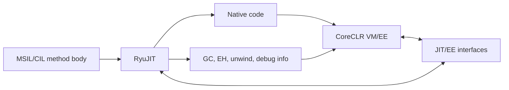

Example:

- `src/coreclr/vm/jitinterface.cpp` calls `jitCompiler->compileMethod(...)`.
- `src/coreclr/jit/ee_il_dll.cpp` implements `CILJit::compileMethod(...)`.
- The method body is represented by `CORINFO_METHOD_INFO`, passed from VM to JIT.

## 2. External API Design

The public JIT/EE boundary is intentionally split into two interfaces:

- `ICorJitCompiler`: implemented by the JIT and called by the VM.
- `ICorJitInfo`: implemented by the VM and called back by the JIT.

API graph:

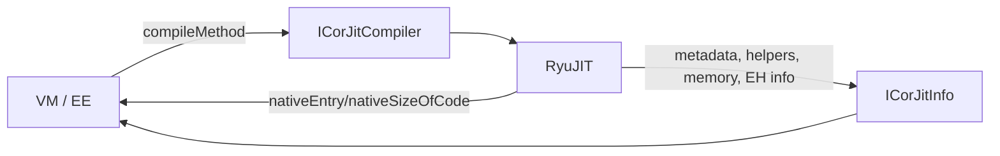

Important API points:

- `ICorJitCompiler::compileMethod` is the main entry point. Its inputs are the VM
  callback object, `CORINFO_METHOD_INFO`, flags, and output pointers for native entry
  and code size.
- `ICorJitCompiler::getVersionIdentifier` versions the JIT/EE interface. `corjit.h`
  explicitly states that any JIT/EE interface change must update the version GUID.
- `ICorJitInfo` exposes services such as code memory allocation, unwind information,
  token resolution, metadata lookup, helper lookup, and reporting fatal errors.

Concrete example:

```cpp
CorJitResult CILJit::compileMethod(ICorJitInfo*         compHnd,
                                   CORINFO_METHOD_INFO* methodInfo,
                                   unsigned             flags,
                                   uint8_t**            entryAddress,
                                   uint32_t*            nativeSizeOfCode)
```

In `src/coreclr/jit/ee_il_dll.cpp`, this function:

- Fetches JIT flags from `compHnd->getJitFlags(...)`.
- Initializes JIT TLS with `JitTls jitTls(compHnd)`.
- Calls `jitNativeCode(...)`.
- Writes `*entryAddress` only when the result is `CORJIT_OK`.

VM-side example:

`invokeCompileMethod` in `src/coreclr/vm/jitinterface.cpp` first tries an altjit when
enabled, then falls back to the normal compiler. On success, it calls
`CompressDebugInfo` and `MethodCompileComplete`.

## 3. Top-Level Compilation Flow

The top-level compilation path is:

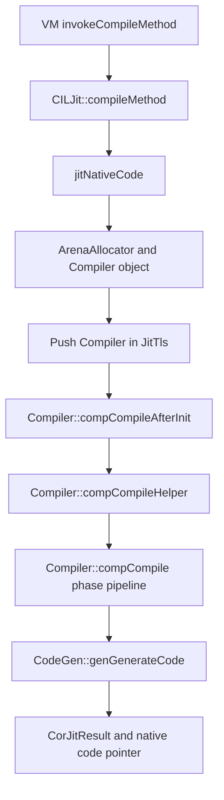

Concrete example:

- `jitNativeCode` allocates memory for a `Compiler` object using an `ArenaAllocator`.
- It placement-news `Compiler(...)`.
- It pushes the active `Compiler` into JIT TLS.
- It calls `compCompileAfterInit(...)`.
- The `finallyErrorTrap` block clears `info.compCode`, pops TLS, and destroys the arena
  for root method compilations.

Important design point:

Each method compilation gets its own `Compiler` object. The main IR, options, phase
state, local variable table, flow graph, and target-specific code generation state hang
off this object. This keeps most per-method state isolated and avoids needing internal
compiler synchronization for a single compile.

## 4. Compiler Object and Global Per-Method State

`Compiler` is the root object for a method compilation. It is not just a driver; it
owns or references nearly all per-method state.

Architecture graph:

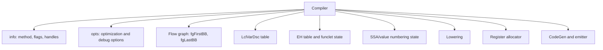

Examples from `src/coreclr/jit/compiler.h`:

- `fgFirstBB` and `fgLastBB` point to the doubly-linked basic block list.
- `fgBBcount` tracks the number of basic blocks.
- `m_loops`, `m_domTree`, `m_domFrontiers`, and `m_reachabilitySets` hold flow graph
  analysis annotations used by optimization phases.
- `fgOrder` records whether tree order or linear order is dominant.
- `fgNodeThreading` records what `GenTree::gtPrev` and `GenTree::gtNext` currently mean.

## 5. Main Intermediate Representation

RyuJIT uses a modal IR:

- HIR: high-level tree form used by the frontend and most optimization phases.
- LIR: linear node form used by the backend after rationalization.
- Emitter IR: `instrDesc` and instruction groups used while encoding final machine code.

IR graph:

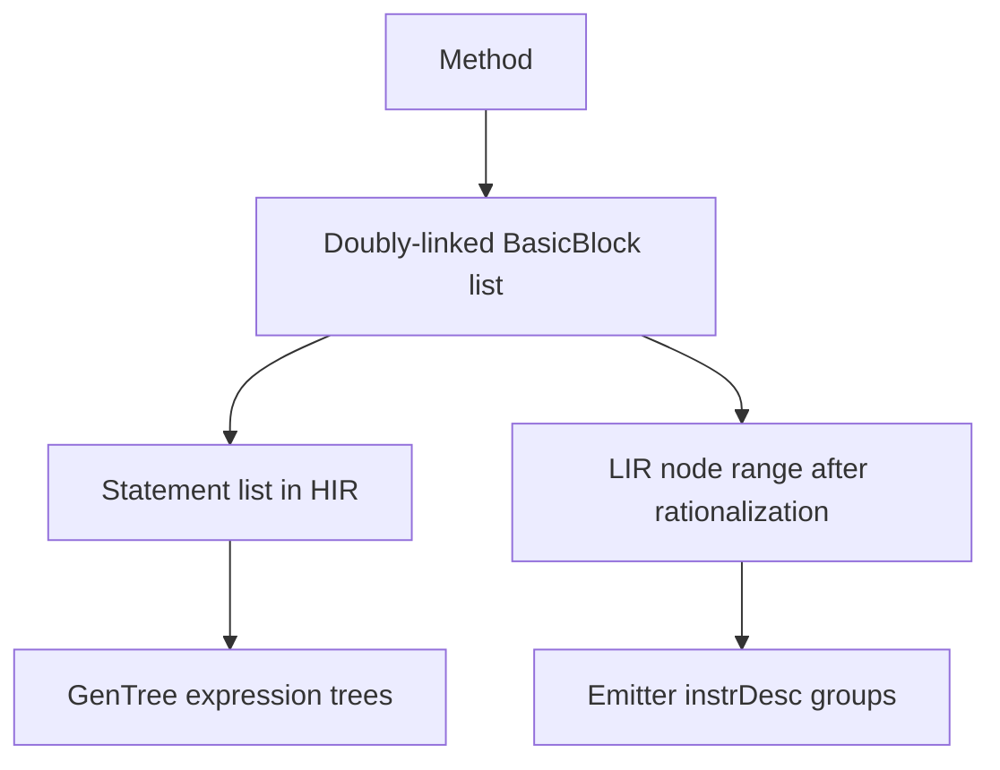

### BasicBlock

`BasicBlock` is the unit of control flow. In `src/coreclr/jit/block.h`, a block has:

- `bbNext` and `bbPrev` links.
- `bbKind` for the jump kind at the end of the block.
- `bbStmtList` for HIR statements.
- successor edge fields such as `bbTargetEdge`, `bbTrueEdge`, `bbFalseEdge`, or switch
  descriptors.

Example:

```cpp
struct BasicBlock : private LIR::Range
{
    BasicBlock* bbNext;
    BasicBlock* bbPrev;
    BBKinds bbKind;
    Statement* bbStmtList;
    FlowEdge* bbFalseEdge;
};
```

The real code uses accessors and invariants around those fields, but this shows the
shape: blocks are linked in lexical/layout order and edges model control flow.

### FlowEdge

`FlowEdge` represents predecessor/successor relationships. It stores source block,
destination block, likelihood, duplicate count, and visited flags.

Flow graph example:

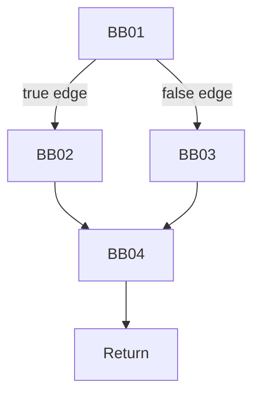

The code keeps predecessor lists in `bbPreds` via `FlowEdge` and updates them through
flow graph phases.

### Statement

`Statement` wraps one root tree in HIR.

Important fields in `src/coreclr/jit/gentree.h`:

- `m_rootNode`: root of the expression tree.
- `m_treeList`: first node in evaluation order when sequencing is available.
- `m_treeListEnd`: end node for local-only threading.
- `m_next` and `m_prev`: doubly-linked statement list.

Example:

```cpp
struct Statement
{
    GenTree* GetRootNode() const;
    GenTree* GetTreeList() const;
    Statement* GetNextStmt() const;

private:
    GenTree* m_rootNode;
    GenTree* m_treeList;
    GenTree* m_treeListEnd;
    Statement* m_next;
    Statement* m_prev;
};
```

### GenTree

`GenTree` is the operation node. Each node has:

- `gtOper`: operation code such as `GT_ADD`, `GT_LCL_VAR`, `GT_CALL`, `GT_IND`.
- `gtType`: result type such as `TYP_INT`, `TYP_REF`, `TYP_STRUCT`.
- value numbering and assertion metadata when available.
- CSE metadata in `gtCSEnum`.
- LIR flags after rationalization.
- `gtNext` and `gtPrev` links whose meaning depends on phase state.

Example:

```cpp
struct GenTree
{
    genTreeOps gtOper;
    var_types  gtType;
    signed char gtCSEnum;
    unsigned char gtLIRFlags;
    GenTree* gtNext;
    GenTree* gtPrev;
};
```

### LclVarDsc

`LclVarDsc` is the descriptor for arguments, user locals, and JIT-created temps.
Important flags include:

- `lvType`: local type.
- `lvIsParam`: parameter marker.
- `lvTracked`: participates in liveness/SSA/register allocation tracking.
- `lvRegister`: assigned one register for the full method.
- `lvDoNotEnregister`: disqualified from enregistration.
- `lvInSsa`: SSA information exists.
- `lvPromoted`, `lvIsStructField`, `lvFieldCnt`: struct promotion information.
- OSR and stack allocation flags such as `lvIsOSRLocal` and `lvStackAllocatedObject`.

Local variable graph:

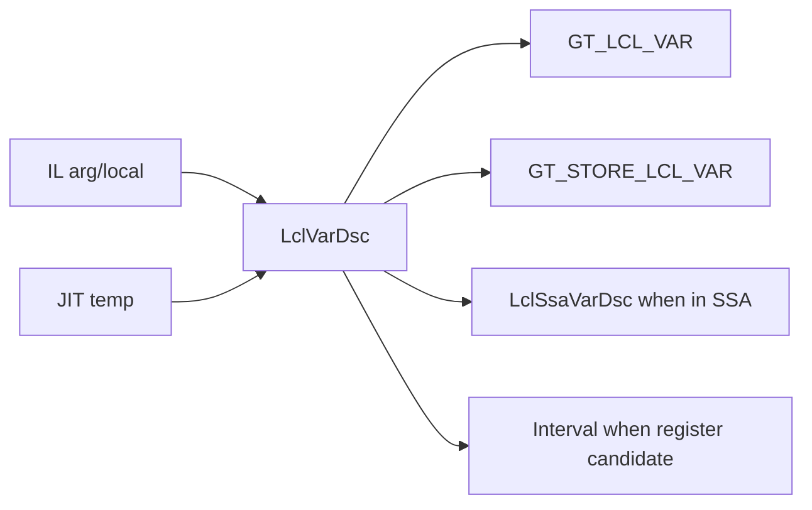

## 6. HIR, Sequencing, and LIR

The IR changes meaning across phases.

Architecture graph:

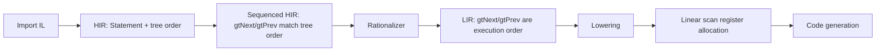

Examples:

- `Compiler::fgOrder` starts as `FGOrderTree`.
- `fgSetBlockOrder` threads all nodes while still in tree order.
- `Rationalizer rat(this); rat.Run();` converts the IR before backend phases.
- After rationalization, `fgNodeThreading = NodeThreading::LIR`.

Important invariant:

In HIR, tree structure and tree walk order are semantically important. In LIR, the
linear list order is the primary execution order. This is why backend code often uses
`for (GenTree* tree : LIR::AsRange(block))`.

## 7. Phase Pipeline

The phase list is declared in `src/coreclr/jit/compphases.h`. The actual driver is
`Compiler::compCompile` in `src/coreclr/jit/compiler.cpp`.

High-level phase graph:

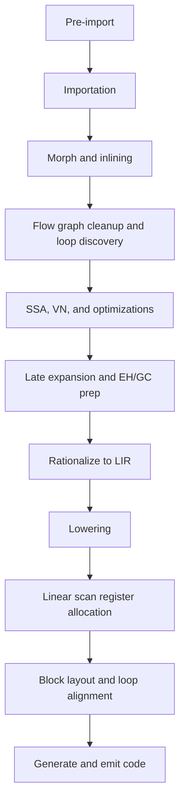

Representative phases from `compphases.h`:

- `PHASE_IMPORTATION`
- `PHASE_MORPH_INLINE`
- `PHASE_LOCAL_MORPH`
- `PHASE_BUILD_SSA`
- `PHASE_VALUE_NUMBER`
- `PHASE_OPTIMIZE_VALNUM_CSES`
- `PHASE_ASSERTION_PROP_MAIN`
- `PHASE_OPTIMIZE_INDEX_CHECKS`
- `PHASE_RATIONALIZE`
- `PHASE_LOWERING`
- `PHASE_LINEAR_SCAN`
- `PHASE_GENERATE_CODE`
- `PHASE_EMIT_CODE`
- `PHASE_EMIT_GCEH`

Concrete driver example:

`Compiler::compCompile` calls phases through `DoPhase(...)`, for example:

```cpp
DoPhase(this, PHASE_IMPORTATION, &Compiler::fgImport);
DoPhase(this, PHASE_MORPH_INLINE, &Compiler::fgInline);
DoPhase(this, PHASE_BUILD_SSA, &Compiler::fgSsaBuild);
DoPhase(this, PHASE_VALUE_NUMBER, &Compiler::fgValueNumber);
```

Design point:

`DoPhase` gives the compiler one uniform mechanism for phase execution, timing,
debug dumps, checking, and metrics. Phase boundaries are also where many IR invariants
are validated in checked/debug builds.

## 8. Importer Design

The importer translates IL stack semantics into RyuJIT trees and basic blocks.

Importer graph:

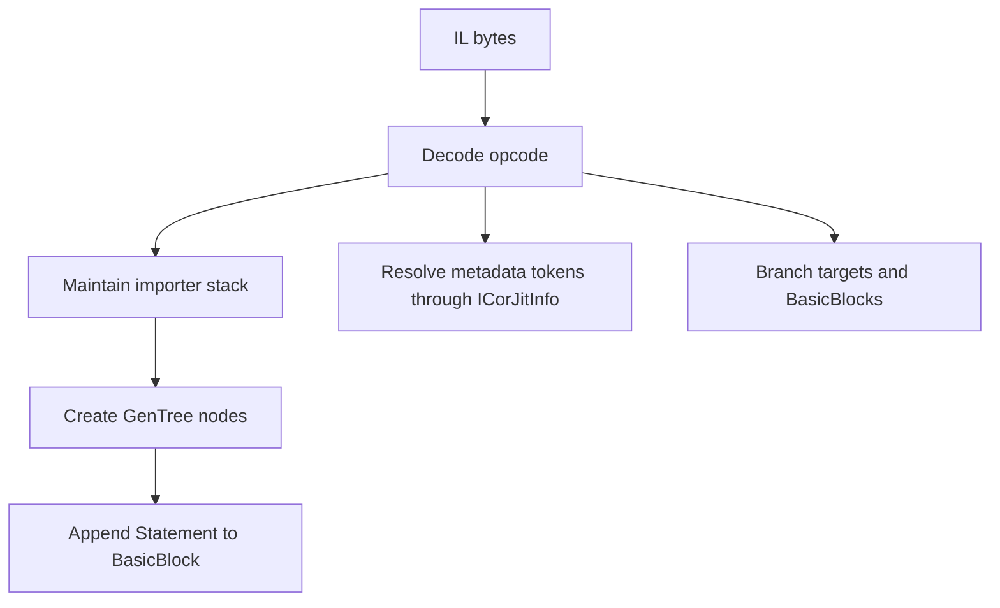

Examples from `src/coreclr/jit/importer.cpp`:

- `impPushOnStack(GenTree* tree, typeInfo ti)` pushes an imported tree onto the
  importer stack and records use of long or floating-point values.
- `impPopStack()` validates stack depth and returns the top `StackEntry`.
- `impResolveToken(...)` fills `CORINFO_RESOLVED_TOKEN` and calls
  `info.compCompHnd->resolveToken(...)`.

Error handling example:

```cpp
if (stackState.esStackDepth == 0)
{
    BADCODE("stack underflow");
}
```

This treats invalid IL stack behavior as `CORJIT_BADCODE`, not an internal compiler
failure.

## 9. Morphing and Inlining

Morphing normalizes trees, expands high-level operations, performs local rewrites, and
prepares the IR for global optimizations and backend legality.

Morphing graph:

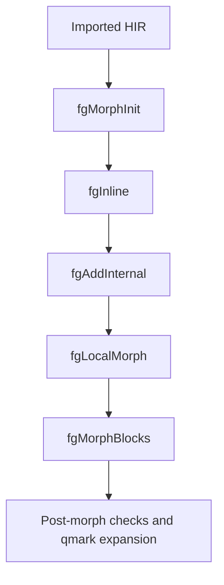

Examples from `Compiler::compCompile`:

- `fgInline` runs after morph init and before many optimizations.
- `fgLocalMorph` simplifies local accesses and marks address-exposed locals.
- `fgMorphBlocks` morphs all trees in all blocks.
- `fgExpandQmarkNodes` removes most remaining `GT_QMARK` forms by expanding them into
  control flow.

Design point:

RyuJIT often uses morphing to turn semantically rich IR into simpler or more explicit
IR. For example, array operations, helper calls, struct operations, tail calls, casts,
and static access patterns may be rewritten or expanded.

## 10. Object Stack Allocation and Struct Promotion

The compiler has several transformations that reduce allocation and improve scalar
optimization.

Architecture graph:

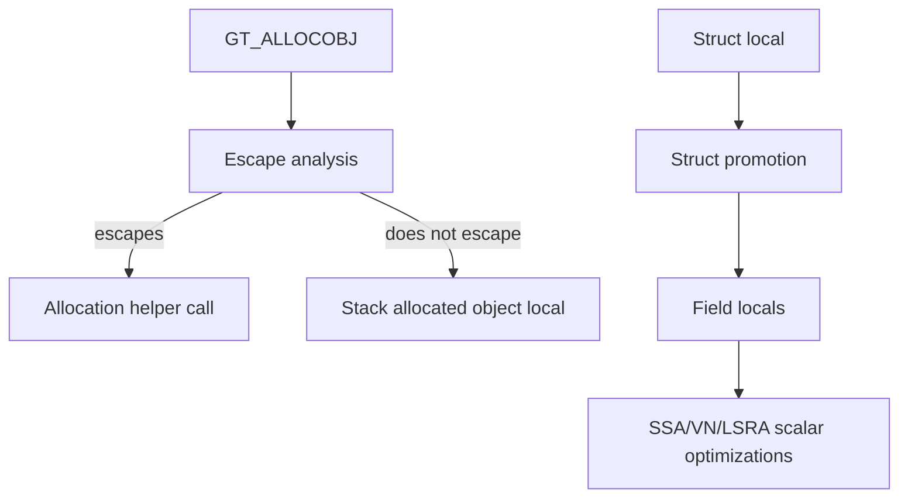

Examples:

- `ObjectAllocator objectAllocator(this); objectAllocator.Run();` appears in
  `Compiler::compCompile`.
- `PHASE_PROMOTE_STRUCTS` calls `Compiler::fgPromoteStructs`.
- `PHASE_PHYSICAL_PROMOTION` calls `Compiler::PhysicalPromotion`.
- `LclVarDsc` has flags such as `lvPromoted`, `lvIsStructField`, `lvFieldCnt`, and
  `lvStackAllocatedObject`.

Design point:

Promotion turns some aggregate operations into primitive local operations. This improves
value numbering, assertion propagation, copy propagation, CSE, and register allocation
because primitive locals are easier to reason about than arbitrary struct memory.

## 11. Flow Graph, EH, and Profile Information

The flow graph is continuously refined.

Flow graph design:

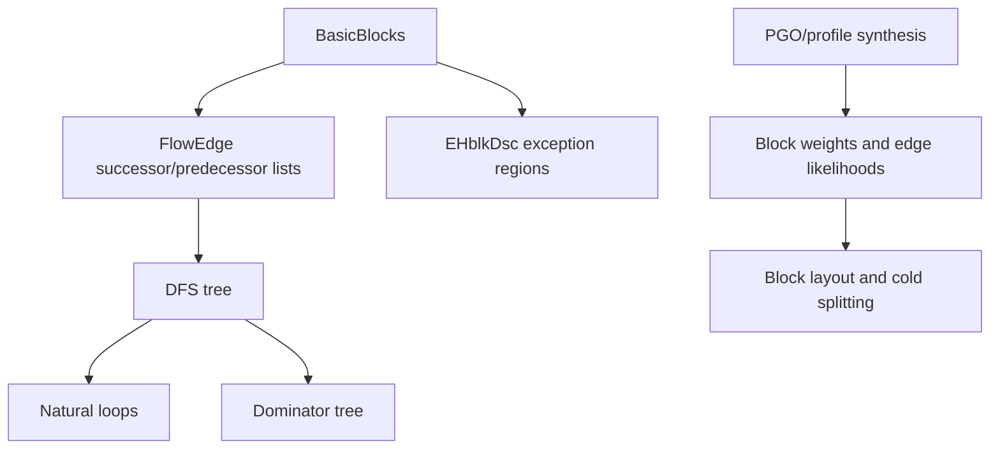

Examples:

- `fgDfsBlocksAndRemove` builds DFS order and removes unreachable blocks.
- `optFindLoopsPhase` discovers natural loops.
- `fgComputeDominators` computes dominators for SSA and copy propagation.
- `fgRepairProfile` re-establishes profile consistency after transformations.
- `optSetBlockWeights` scales loop blocks and adjusts heuristic block weights when no
  profile weights are available.

Concrete optimization example:

`Compiler::optScaleLoopBlocks` applies loop block weight scaling when no profile weight
is available. Comments describe the heuristic as making loop nesting weights roughly
1, 8, 64, 512 for increasing nesting depth.

## 12. SSA and Value Numbering

SSA and value numbering are the foundation for many middle-end optimizations.

Architecture graph:

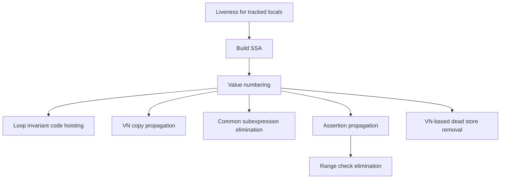

Examples from `Compiler::compCompile`:

- `PHASE_BUILD_SSA` calls `fgSsaBuild`.
- `PHASE_VALUE_NUMBER` calls `fgValueNumber`.
- `PHASE_HOIST_LOOP_CODE` calls `optHoistLoopCode`.
- `PHASE_VN_COPY_PROP` calls `optVnCopyProp`.
- `PHASE_OPTIMIZE_VALNUM_CSES` calls `optOptimizeCSEs`.
- `PHASE_ASSERTION_PROP_MAIN` calls `optAssertionPropMain`.
- `PHASE_OPTIMIZE_INDEX_CHECKS` calls `rangeCheckPhase`.
- `PHASE_VN_BASED_DEAD_STORE_REMOVAL` calls `optVNBasedDeadStoreRemoval`.

Design point:

Only tracked locals participate fully in liveness/SSA. This is a throughput choice:
the compiler limits expensive dataflow to a bounded set of locals, while untracked
locals are treated more like stack locations.

## 13. Optimization Examples

### Loop and flow optimizations

RyuJIT runs flow cleanup, loop discovery, loop inversion, loop cloning, unrolling, and
layout optimization.

Graph:

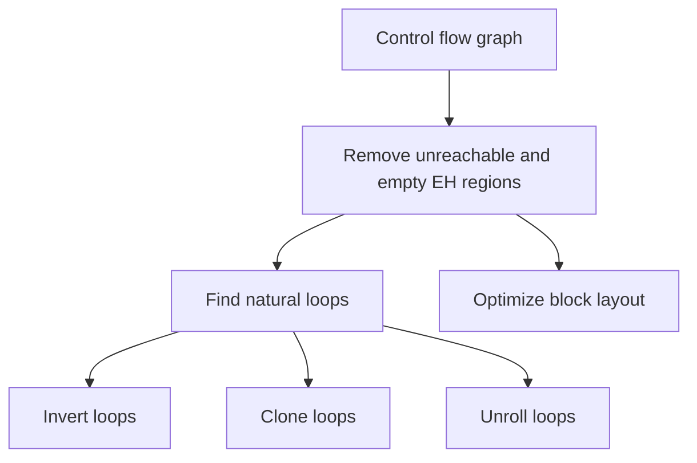

Examples:

- `PHASE_FIND_LOOPS`: `optFindLoopsPhase`
- `PHASE_INVERT_LOOPS`: `optInvertLoops`
- `PHASE_CLONE_LOOPS`: `optCloneLoops`
- `PHASE_UNROLL_LOOPS`: `optUnrollLoops`
- `PHASE_OPTIMIZE_LAYOUT`: `fgSearchImprovedLayout`

### Bounds check optimizations

Bounds checks are optimized by value numbering, assertions, range analysis, and
coalescing.

Graph:

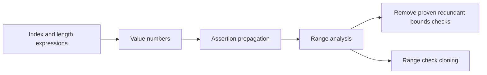

Examples:

- `PHASE_BOUNDS_CHECK_COALESCE`: `optBoundsCheckCoalesce`
- `PHASE_OPTIMIZE_INDEX_CHECKS`: `rangeCheckPhase`
- `PHASE_RANGE_CHECK_CLONING`: `optRangeCheckCloning`

### CSE

Common subexpression elimination uses value numbers to identify equivalent expressions
and introduce/reuse temps.

Graph:

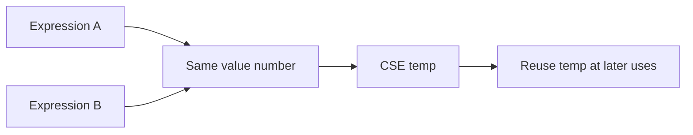

Example:

`GenTree::gtCSEnum` marks CSE expressions. The macros `IS_CSE_USE`, `IS_CSE_DEF`,
`GET_CSE_INDEX`, and `TO_CSE_DEF` in `gentree.h` show the compact representation:
positive values for uses, negative values for defs.

### If conversion and boolean optimization

RyuJIT can convert some conditional definitions to select-like operations and simplify
boolean expressions.

Graph:

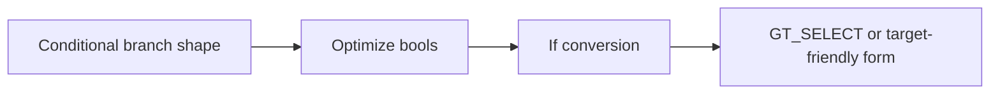

Examples:

- `PHASE_OPTIMIZE_BOOLS`: `optOptimizeBools`
- `PHASE_IF_CONVERSION`: `optIfConversion`

### Hardware intrinsics and target-specific lowering

Hardware intrinsics are represented in IR and then lowered/code-generated by target.

Graph:

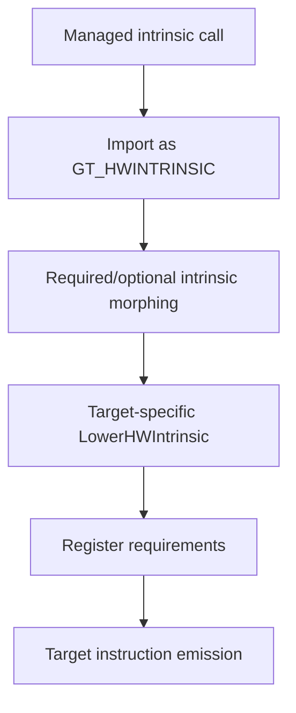

Examples:

- `hwintrinsic*.cpp` files implement intrinsic import/morph/lowering/codegen support.
- `lowerxarch.cpp` has `Lowering::LowerHWIntrinsic`.
- `hwintrinsiccodegenxarch.cpp`, `hwintrinsiccodegenarm64.cpp`, and
  `hwintrinsiccodegenwasm.cpp` are target-specific codegen files.

## 14. Rationalization

Rationalization converts HIR to LIR.

Graph:

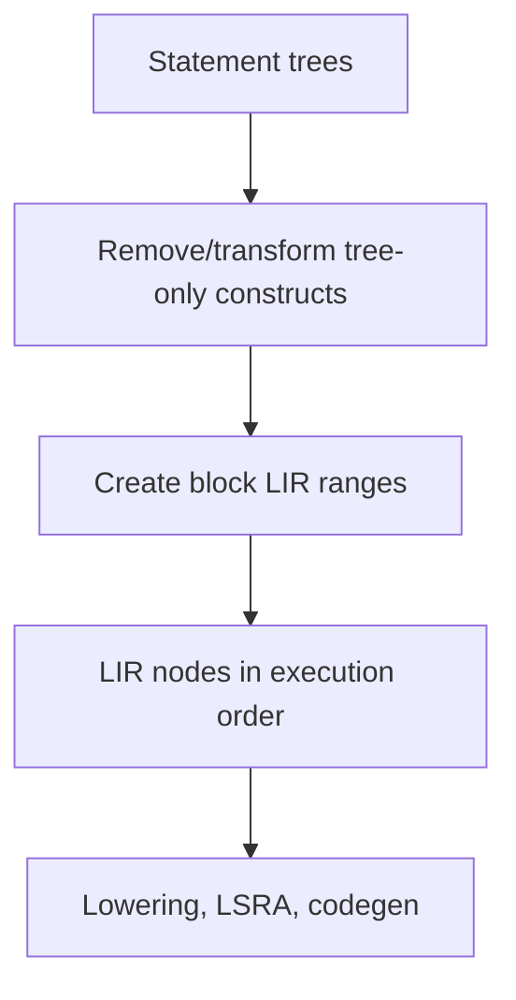

Example:

`Compiler::compCompile` creates `Rationalizer rat(this);` and calls `rat.Run();`.
Immediately after this, it sets `fgNodeThreading = NodeThreading::LIR`.

Design point:

The backend wants explicit execution order and explicit data dependencies. LIR makes
backend passes easier because each block has a linear range of nodes and the list order
is authoritative.

## 15. Lowering

Lowering prepares LIR for register allocation and code generation. It is partly common
and partly target-specific.

Lowering graph:

```mermaid
flowchart TD
    LIR[Legal but abstract LIR] --> Containment[Mark contained operands]
    LIR --> RegOptional[Mark register-optional operands]
    LIR --> Decomp[Decompose unsupported forms]
    LIR --> Addr[Recognize addressing modes]
    LIR --> NodeInfo[Set register requirements]
    NodeInfo --> LSRA[Linear scan register allocation]
```

Examples from `src/coreclr/jit/lower.cpp`:

- `MakeSrcContained(parentNode, childNode)` marks an operand as contained in its parent.
- `MakeSrcRegOptional(parentNode, childNode)` marks an operand as not requiring a
  register if profitable/legal.
- `TryMakeSrcContainedOrRegOptional` chooses between containment and register optional
  behavior.
- `IsSafeToContainMem` checks side-effect and ordering safety before memory containment.

Target-specific examples:

- `lowerxarch.cpp` handles x86/x64 lowering, including memory containment and RMW forms.
- `lowerarmarch.cpp` handles ARM/ARM64 shared lowering.
- `lowerriscv64.cpp`, `lowerloongarch64.cpp`, and `lowerwasm.cpp` handle other targets.

## 16. Register Allocation

RyuJIT uses linear scan register allocation (LSRA).

Register allocation graph:

```mermaid
flowchart TD
    LIR[Lowered LIR] --> Build[Build intervals and ref positions]
    Build --> Allocate[Allocate physical registers]
    Allocate --> Spill[Spill/split when needed]
    Spill --> Resolve[Resolve edge moves and locations]
    Resolve --> Annotated[IR annotated with registers, spills, reloads]
```

Example from `src/coreclr/jit/lsra.cpp`:

`LinearScan::doRegisterAllocation`:

- Disables local enregistration when there are no tracked locals.
- Clears modified register state.
- Builds intervals with or without local enregistration.
- Ends `PHASE_LINEAR_SCAN_BUILD`.
- Initializes variable-register maps.
- Allocates registers, using a minimal path for MinOpts/no-enregistered-locals.
- Ends `PHASE_LINEAR_SCAN_ALLOC`.
- Resolves registers and ends `PHASE_LINEAR_SCAN_RESOLVE`.

Concrete detail:

`allocateRegistersMinimal` iterates over `refPositions`, manages register state, handles
kill positions, frees registers, and assigns registers for node requirements without
the full local-variable enregistration machinery.

Design point:

LSRA works on an IR that is still higher-level than final machine instructions. Lowering
annotates nodes with enough register requirements for LSRA; codegen later consumes the
assigned registers.

## 17. Code Generation and Emission

Code generation converts lowered, register-allocated LIR into target machine
instructions and metadata.

Codegen graph:

```mermaid
flowchart TD
    LIR[Register-allocated LIR] --> Gen[genGenerateMachineCode]
    Gen --> Instr[Emitter instruction descriptors]
    Instr --> Emit[emitEndCodeGen]
    Emit --> Native[Native code buffers]
    Emit --> GC[GC info]
    Emit --> EH[EH/unwind/debug tables]
```

Examples from `src/coreclr/jit/codegencommon.cpp`:

- `CodeGen::genGenerateCode` runs three subphases:
  - `PHASE_GENERATE_CODE`: `genGenerateMachineCode`
  - `PHASE_EMIT_CODE`: `genEmitMachineCode`
  - `PHASE_EMIT_GCEH`: `genEmitUnwindDebugGCandEH`
- Later, code generation calls `emitEndCodeGen(...)` to finalize code buffers and
  metadata.

Target-specific design:

- Common codegen lives in `codegencommon.cpp` and `codegenlinear.cpp`.
- Target files include `codegenxarch.cpp`, `codegenarm64.cpp`, `codegenriscv64.cpp`,
  `codegenloongarch64.cpp`, and `codegenwasm.cpp`.
- Emitters are similarly split, for example `emitxarch.cpp`, `emitarm64.cpp`,
  `emitriscv64.cpp`, and `emitwasm.cpp`.

## 18. Memory Management

RyuJIT uses arena allocation heavily for per-compilation data.

Memory graph:

```mermaid
flowchart TD
    jitNativeCode --> Arena[ArenaAllocator]
    Arena --> CompilerObj[Compiler object]
    Arena --> IR[IR nodes and analysis data]
    Arena --> Inline[Inlinee compiler data can reuse inliner arena]
    Finish[finallyErrorTrap] --> Destroy[Destroy root arena]
```

Examples:

- `jitNativeCode` uses a local `ArenaAllocator alloc` for root method compilations.
- Inlinee compilation uses the inliner's allocator.
- The compiler object is placement-new'd into arena memory.
- The root allocator is destroyed in the `finallyErrorTrap` block.
- Many allocations use `new (this, CMK_...)` or `getAllocator(...)` to attach memory to
  a per-phase or per-purpose arena kind.

Design point:

Arena allocation matches compiler lifetime well: most data lives for the whole method
compile and can be freed all at once.

## 19. Error Handling

RyuJIT does not use ordinary C++ exceptions for expected compile failure categories.
It raises a special fatal JIT exception internally and maps it to `CorJitResult`.

Error handling graph:

```mermaid
flowchart TD
    Error[BADCODE / NO_WAY / IMPL_LIMITATION / NOMEM] --> Fatal[fatal CorJitResult]
    Fatal --> Raise[RaiseException FATAL_JIT_EXCEPTION]
    Raise --> Filter[__JITfilter]
    Filter --> Report[ICorJitInfo::reportFatalError]
    Filter --> Result[Return CorJitResult]
    Result --> Retry{Fallback eligible?}
    Retry -->|yes| MinOpts[Retry with MIN_OPT]
    Retry -->|no| VM[Return failure to VM]
```

Error categories from `src/coreclr/inc/corjit.h`:

- `CORJIT_OK`
- `CORJIT_BADCODE`
- `CORJIT_OUTOFMEM`
- `CORJIT_INTERNALERROR`
- `CORJIT_SKIPPED`
- `CORJIT_RECOVERABLEERROR`
- `CORJIT_IMPLLIMITATION`
- `CORJIT_R2R_UNSUPPORTED`

Macros and functions from `src/coreclr/jit/error.h` and `error.cpp`:

- `BADCODE(msg)` means invalid IL or verification-like failure.
- `NO_WAY(msg)` means an internal compiler path cannot continue.
- `IMPL_LIMITATION(msg)` means valid IL is unsupported by the current implementation.
- `NOMEM()` means allocation failure.
- `NYI(msg)` can skip or assert depending on configuration.

Concrete examples:

- `impPopStack()` in `importer.cpp` calls `BADCODE("stack underflow")`.
- Some emitter paths call `IMPL_LIMITATION("Method is too large")`.
- `jitNativeCode` catches failures and, for root methods, retries certain failures in
  safer MinOpts mode by setting `JIT_FLAG_MIN_OPT` and clearing size/speed/basic-block
  optimization flags.

Fallback example:

If `jitNativeCode` gets `CORJIT_INTERNALERROR`, `CORJIT_RECOVERABLEERROR`,
`CORJIT_IMPLLIMITATION`, or `CORJIT_R2R_UNSUPPORTED`, and this is not already a fallback
compile, it retries with MinOpts.

## 20. Coding Style

The style is old C++ with strong local conventions.

Style graph:

```mermaid
flowchart TD
    File[Component file] --> Header[File banner/header]
    Header --> Comments[Block comments explain why/how]
    Comments --> Names[Historical prefixes and component names]
    Names --> Phases[Phase methods grouped by component]
    Phases --> Debug[DEBUG-only checks, dumps, stress hooks]
```

Observed conventions:

- 4 spaces, no tabs, around 120 columns as a baseline.
- Prefer `//` comments, but large banner comments are common in JIT files.
- Comments should explain why/how, not just repeat the code.
- TODOs are categorized, for example `TODO-CQ`, `TODO-Cleanup`, `TODO-Bug`.
- Debug-only paths are common and guarded by `#ifdef DEBUG`.
- Assertions are heavy and encode phase invariants.
- Names are historically prefixed by subsystem:
  - `comp*` for top-level compiler behavior.
  - `fg*` for flow graph.
  - `imp*` for importer.
  - `lva*` for local variable analysis.
  - `opt*` for optimizer.
  - `gen*` for code generation.
  - `emit*` for emitter.
  - `gt*` for GenTree utilities.

Example:

`Compiler::compCompile`, `Compiler::fgImport`, `Compiler::fgMorphBlocks`,
`Compiler::optOptimizeCSEs`, `CodeGen::genGenerateCode`, and
`emitter::emitEndCodeGen` all reveal subsystem ownership by name.

## 21. Debugging, Dumps, Stress, and Metrics

RyuJIT has extensive internal debugging and instrumentation.

Graph:

```mermaid
flowchart TD
    Config[JitConfig / DOTNET_* knobs] --> Dumps[JITDUMP and disasm]
    Config --> Stress[Stress modes]
    Config --> Metrics[JitMetrics]
    Phases[DoPhase] --> Checks[Post-phase checks]
    Phases --> Timers[Phase timing]
```

Examples:

- `JITDUMP(...)` appears throughout phases to explain transformations in verbose mode.
- `compStressCompile(...)` injects stress behavior in debug builds.
- `JitConfig.JitOptRepeatCount()` can repeat optimization phases.
- `JitConfig.JitReportMetrics()` reports `JitMetrics`.
- `Compiler::compCompileFinish` prints final metrics and optional dump data.
- `viewing-jit-dumps.md` under docs explains how to read dumps.

Design point:

The compiler is built to be inspected phase-by-phase. This is necessary because many
bugs are phase-ordering or invariant bugs rather than local syntax bugs.

## 22. Tiering, OSR, Patchpoints, and Dynamic PGO

RyuJIT supports tiered compilation and on-stack replacement (OSR).

Architecture graph:

```mermaid
flowchart TD
    Tier0[Tier0 quick code] --> Patch[Patchpoints]
    Patch --> Runtime[Runtime detects hot loop/method]
    Runtime --> Tier1[Tier1 optimized or OSR compile]
    Tier1 --> OSRInfo[PatchpointInfo maps Tier0 frame to OSR entry]
    OSRInfo --> Native[Optimized native code]
```

Examples:

- `compInitOptions` chooses MinOpts for `JIT_FLAG_TIER0` and speed-oriented code for
  optimized Tier1 flags.
- `Compiler::compCompileAfterInit` fetches OSR info with
  `info.compCompHnd->getOSRInfo(&info.compILEntry)` when `JIT_FLAG_OSR` is set.
- `Compiler::generatePatchpointInfo` records Tier0 frame offsets, exposed locals,
  callee-save registers, and special offsets, then calls
  `info.compCompHnd->setPatchpointInfo(...)`.
- `PHASE_PATCHPOINTS` calls `fgTransformPatchpoints`.

Design point:

OSR requires cooperation between code generation and runtime frame mapping. The JIT
must preserve enough Tier0 local layout information for optimized OSR code to enter
from the middle of a method.

## 23. Target Architecture Structure

The common JIT pipeline is shared across targets, but backend details split by target.

Target graph:

```mermaid
flowchart TD
    Common[Common importer, IR, optimizations] --> LowerCommon[Common lowering]
    LowerCommon --> XArch[x86/x64 files]
    LowerCommon --> Arm[ARM/ARM64 files]
    LowerCommon --> RiscV[RISC-V64 files]
    LowerCommon --> Loong[LoongArch64 files]
    LowerCommon --> Wasm[Wasm files]
    XArch --> EmitX[Target emitter and unwind]
    Arm --> EmitArm[Target emitter and unwind]
    RiscV --> EmitRV[Target emitter and unwind]
    Loong --> EmitLoong[Target emitter and unwind]
    Wasm --> EmitWasm[Wasm emission/control flow]
```

Examples:

- Target headers: `targetamd64.h`, `targetarm64.h`, `targetriscv64.h`,
  `targetwasm.h`.
- Register headers: `registeramd64.h`, `registerarm64.h`, `registerriscv64.h`,
  `registerwasm.h`.
- Instruction lists: `instrsxarch.h`, `instrsarm64.h`, `instrsriscv64.h`,
  `instrswasm.h`.
- Lowering: `lowerxarch.cpp`, `lowerarmarch.cpp`, `lowerriscv64.cpp`,
  `lowerwasm.cpp`.
- Codegen: `codegenxarch.cpp`, `codegenarm64.cpp`, `codegenriscv64.cpp`,
  `codegenwasm.cpp`.
- Emitters: `emitxarch.cpp`, `emitarm64.cpp`, `emitriscv64.cpp`, `emitwasm.cpp`.

Design point:

Target separation happens after common semantic work. The frontend and middle-end try
to stay target-independent; lowering and codegen expose target instruction constraints.

## 24. WebAssembly-Specific Phases

Wasm has extra control-flow and GC-reference constraints.

Wasm graph:

```mermaid
flowchart TD
    LIR[Post-rationalization LIR] --> WasmEH[Wasm EH flow]
    WasmEH --> DFS[Remove unreachable blocks]
    DFS --> SCC[Transform SCCs]
    Lower[Lowering] --> SpillRefs[Spill refs live at calls]
    SpillRefs --> Control[Wasm control flow nesting]
    Control --> WasmCodegen[Wasm codegen/emitter]
```

Examples from `Compiler::compCompile` and `compphases.h`:

- `PHASE_WASM_EH_FLOW`
- `PHASE_DFS_BLOCKS_WASM`
- `PHASE_WASM_TRANSFORM_SCCS`
- `PHASE_WASM_VIRTUAL_IP`
- `PHASE_WASM_SPILL_REFS`
- `PHASE_WASM_CONTROL_FLOW`

Design point:

Wasm is not just another register-machine target. It needs structured control-flow
work and specific handling for references and EH.

## 25. Data Contracts with the VM

RyuJIT depends on the VM for facts it cannot know from IL alone.

Contract graph:

```mermaid
flowchart LR
    JIT --> Tokens[resolveToken]
    JIT --> Types[Class and method metadata]
    JIT --> Helpers[Runtime helper addresses]
    JIT --> Alloc[allocMem code/data buffers]
    JIT --> Unwind[reserve/alloc unwind info]
    JIT --> GC[GC info reporting]
    VM --> JIT
```

Examples:

- `corinfo.h` documents that IL metadata tokens are resolved through
  `ICorStaticInfo::resolveToken`, and validation is done as part of token resolution.
- `ICorJitInfo::allocMem` allocates hot code, cold code, and data chunks.
- `ICorJitInfo::reserveUnwindInfo` must be called before `allocMem`.
- `ICorJitInfo::allocUnwindInfo` records machine-specific unwind information.

Design point:

The JIT intentionally uses opaque handles such as `CORINFO_CLASS_HANDLE`,
`CORINFO_METHOD_HANDLE`, and `CORINFO_FIELD_HANDLE`. This keeps runtime object layouts
and metadata ownership inside the VM.

## 26. Invariants and Phase Safety

Many bugs in a JIT are caused by stale annotations. RyuJIT uses explicit flags and
phase boundaries to manage this.

Invariant graph:

```mermaid
flowchart TD
    Transform[IR transform] --> Mark[Set fgModified or invalidate data]
    Mark --> Recompute[Recompute DFS/dominators/loops/liveness/VN as needed]
    Recompute --> Check[Debug phase checks]
    Check --> Next[Next phase consumes valid state]
```

Examples:

- `fgInvalidateDfsTree()` is called after transformations that can change control flow.
- `vnStore = nullptr` conservatively marks value numbers stale after optimization
  iterations.
- `fgResetForSsa(...)` removes SSA annotations after optimization.
- `lvaTrackedFixed = true` is set after lowering, indicating new tracked variables
  cannot be added.
- `FinalizeEH()` sets `ehTableFinalized = true` before register allocation and codegen.

Design point:

The code is defensive about phase ordering. A transformation is not complete unless it
also preserves or invalidates the metadata that later phases rely on.

## 27. How to Read the Code

Suggested reading order:

```mermaid
flowchart TD
    A[docs/design/coreclr/jit/ryujit-overview.md] --> B[src/coreclr/inc/corjit.h]
    B --> C[src/coreclr/jit/ee_il_dll.cpp]
    C --> D[src/coreclr/jit/compiler.cpp]
    D --> E[src/coreclr/jit/compphases.h]
    E --> F[src/coreclr/jit/importer.cpp]
    F --> G[src/coreclr/jit/gentree.h and block.h]
    G --> H[src/coreclr/jit/optimizer.cpp and valuenum.cpp]
    H --> I[src/coreclr/jit/rationalize.cpp and lower.cpp]
    I --> J[src/coreclr/jit/lsra.cpp]
    J --> K[src/coreclr/jit/codegencommon.cpp and target codegen files]
```

Practical notes:

- Start from `CILJit::compileMethod`, but quickly jump to `Compiler::compCompile`.
- Keep `compphases.h` open as a map.
- For IR, read `BasicBlock`, `Statement`, `GenTree`, and `LclVarDsc` definitions before
  reading transformations.
- When a pass looks mysterious, search for its phase enum and `DoPhase` call.
- For target behavior, search both common files and target-specific files.

## 28. Open Follow-Ups for a Deeper Study

This draft covers the main architecture and gives code-grounded examples. Areas worth
expanding in later revisions:

- A worked method from IL through import, morph, SSA/VN, lowering, LSRA, and codegen.
- More detail on `ValueNumStore` and the symbolic value numbering model.
- More detail on class layout, struct promotion, and ABI decomposition.
- More detail on devirtualization, guarded devirtualization, and generic dictionary
  expansion.
- More detail on GC info encoding and reporting.
- More target-specific walkthroughs, especially x64 and ARM64.
- A glossary of common dump terms and JIT flags used during debugging.

